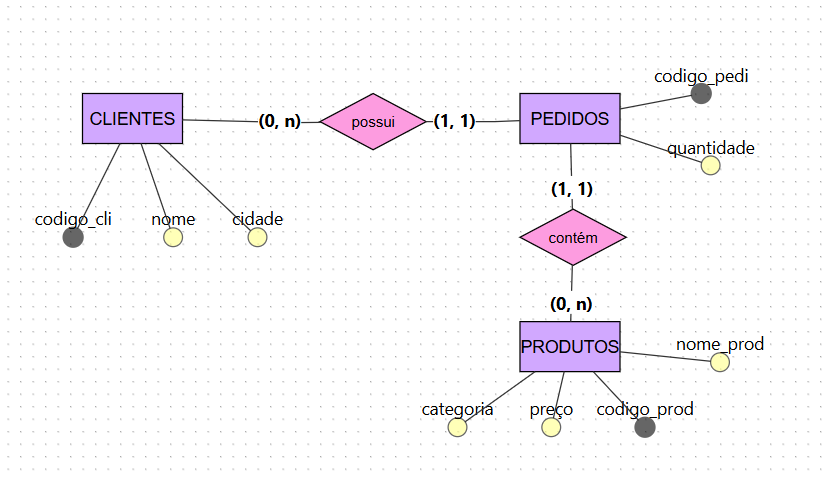
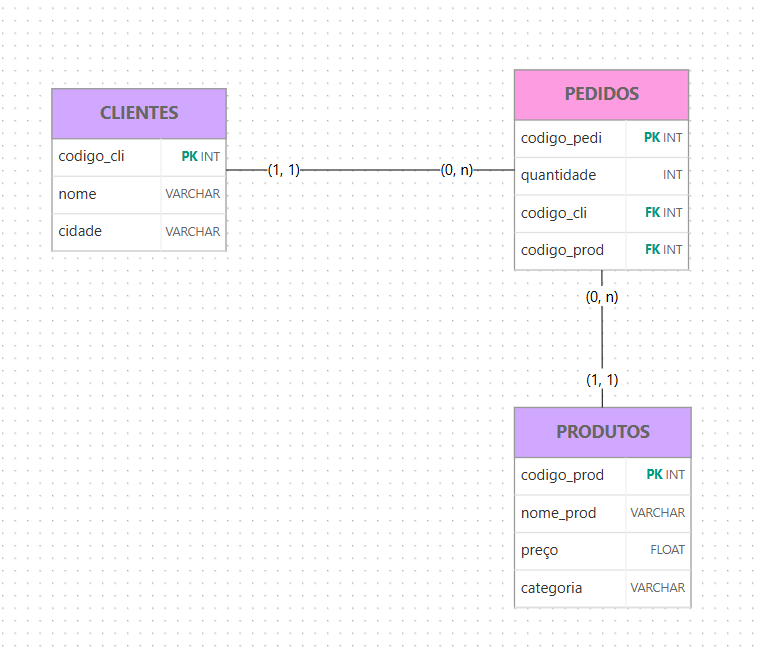
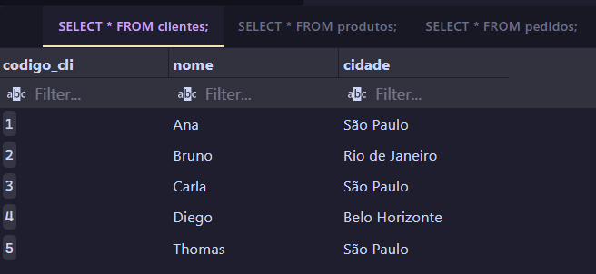
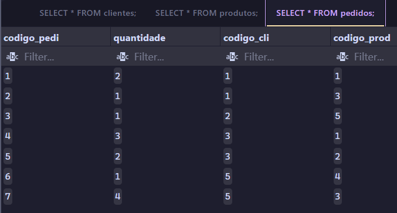
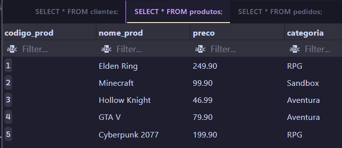
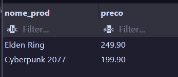
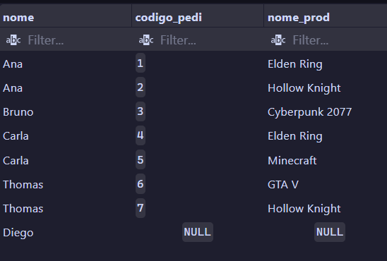
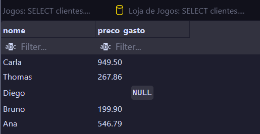
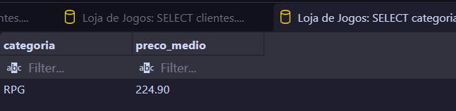
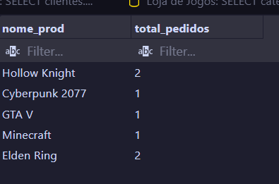

# Atividade de Banco de Dados — Loja de Jogos

Atividade de modelagem e consultas SQL desenvolvida durante o trainee de tecnologia da EJEM.

## Objetivo

Criar os modelos conceitual e lógico de uma loja de jogos, implementar as tabelas, inserir os dados fornecidos e realizar consultas sobre clientes, produtos e pedidos.

## Ferramentas utilizadas

- brModelo.
- PostgreSQL.
- Visual Studio Code.
- SQLTools com o driver PostgreSQL.

## Estrutura do banco de dados

### Clientes

Armazena o código, o nome e a cidade de cada cliente.

- `codigo_cli`: chave primária.
- `nome`: nome do cliente.
- `cidade`: cidade do cliente.

### Produtos

Armazena as informações dos jogos disponíveis.

- `codigo_prod`: chave primária.
- `nome_prod`: nome do produto.
- `preco`: preço do produto.
- `categoria`: categoria do produto.

### Pedidos

Armazena os pedidos e relaciona clientes aos produtos comprados.

- `codigo_pedi`: chave primária.
- `quantidade`: quantidade comprada.
- `codigo_cli`: chave estrangeira que referencia clientes.
- `codigo_prod`: chave estrangeira que referencia produtos.

Neste exercício, cada registro de pedido está associado a um cliente e a um único produto.

## Modelos conceitual e lógico

As imagens e os links dos modelos serão adicionados nesta seção.

 
## Exercícios realizados

### Exercício 1 — Modelagem

Criação dos modelos conceitual e lógico, representando as entidades, os atributos, as chaves e as cardinalidades.

### Exercício 2 — Produtos RPG

Consulta do nome e do preço dos produtos da categoria RPG, ordenados do mais caro para o mais barato.

### Exercício 3 — Clientes e pedidos

Consulta de todos os clientes e seus pedidos, incluindo clientes que não realizaram pedidos.

A consulta também foi ampliada para mostrar o nome do produto comprado.

### Exercício 4 — Total gasto por cliente

Cálculo do total gasto por cliente, somando o preço de cada produto multiplicado pela quantidade comprada.

Clientes sem pedidos aparecem com o total `NULL`.

### Exercício 5 — Média de preço por categoria

Cálculo do preço médio dos produtos de cada categoria, mostrando apenas as categorias cuja média é maior que 100.

A média apresentada foi arredondada para duas casas decimais.

### Exercício 6 — Quantidade de pedidos por produto

Contagem dos pedidos de cada produto, incluindo produtos sem pedidos, que aparecem com total zero.

Essa consulta conta pedidos, não a quantidade de unidades vendidas.

## Resultados

As imagens dos resultados das consultas serão adicionadas nesta seção.

